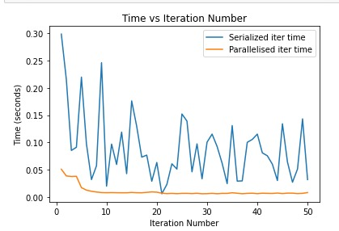

# Decyphering text using parallelized Genetic Algorithm

This project implements a parallelized genetic algorithm to solve decyphering problems. The algorithm includes selection, crossover, and mutation operations to evolve a population of individuals towards an optimal solution.

## Table of Contents

- [Installation](#installation)
- [Project Structure](#project-structure)


## Installation

1. Clone the repository:
    ```sh
    git clone https://github.com/yourusername/genetic-algorithm-project.git
    ```
2. Navigate to the project directory:
    ```sh
    cd genetic-algorithm-project
    ```
3. Compile the project using a C++ compiler:
    ```sh
    g++ -o genetic_algorithm main.cpp NonParallel.cpp -std=c++11
    ```


## Project Structure 

NonParallel.cpp: Contains the implementation of the genetic algorithm, including selection, crossover, and mutation functions in a non parallelised manner (vanilla version)
Parallel.cpp: Contains the code for parallelized implementation of the genetic algorithm, including selection, crossover, and mutation functions using OPENMP


 ### serialized/parallelized perfomance comparison


## Aspects to Parallelize:

Parallelizing aspects like Fitness calculation,Initialization of individuals, Selection of parents, Crossover and Mutation operations can improve
efficiency, performance, lead to faster convergence and speed up the optimization process

### Algorithm Parallelism

Each processor or core can independently evaluate the fitness of a
subset of individuals.
Different processors can independently perform selection operations
• Crossover- Different pairs of parents can undergo crossover
concurrently.
• Mutation- Multiple processors can perform mutation operations on
different individuals simultaneously.
• Population replacement can be parallelized

### TASK PARALLELISM

Dividing overall computation into independent tasks.
Assigning different processors to different tasks require proper
coordination and synchronization


